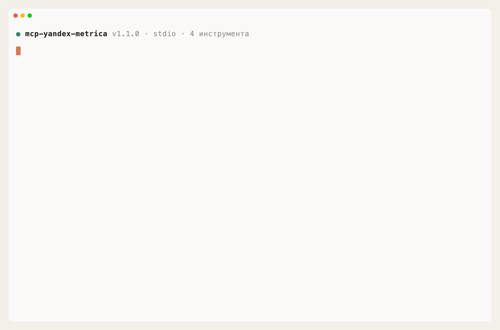

# Yandex Metrica MCP

[](https://www.npmjs.com/package/mcp-yandex-metrica)
[](https://github.com/askads/mcp-yandex-metrica/actions/workflows/ci.yml)
[](https://glama.ai/mcp/servers/askads/mcp-yandex-metrica)
[](./LICENSE)

MCP-сервер для **Yandex Metrica (Яндекс Метрика)**: спрашивайте веб-аналитику — посещаемость,
источники, поведение и конверсии по целям — из Claude, Cursor, Codex и других AI-клиентов на
естественном языке.

Ассистент сам находит счётчики, тянет статистику из Reporting API и сопоставляет цели с
конверсиями — то, что в интерфейсе Метрики приходится собирать вручную по отчётам.



<sub>Настоящая MCP-сессия: реальный сервер, хендшейк и tools/call по stdio через официальный SDK; ответы Яндекс Метрики — записанные фикстуры (<a href="docs/demo">docs/demo</a>), поэтому демо воспроизводится без токена и сети — <a href="docs/demo.tape">vhs docs/demo.tape</a>.</sub>

## Быстрый старт

Токен заранее не нужен — сервер подключается прямо в диалоге.

1. Добавьте сервер — например, в Claude Code ([другие клиенты](#установка)):

   ```bash
   claude mcp add yandex-metrica -- npx -y mcp-yandex-metrica@latest
   ```

2. Скажите ассистенту: «Подключи Яндекс Метрику». Он даст ссылку — войдите под аккаунтом
   с доступом к нужным счётчикам, подтвердите доступ и пришлите показанный код.
3. Спросите: «Какая конверсия по цели "Оформление заказа" за 30 дней?»

Перезапускать клиент не нужно: подключение действует сразу. Если предпочитаете задать
токен переменной окружения — см. [Подключение](#подключение).

> **Без установки:** Метрика входит в удалённый сервер Яндекс Директа — добавьте
> `https://mcp.askads.ru/mcp` по URL ([инструкция](https://github.com/askads/mcp-yandex-direct#подключение-по-url-без-установки)),
> инструменты Метрики видны с префиксом `metrika_`.

## Что умеет

- **Вход из диалога** — `start_login` / `finish_login`: подключение по OAuth с PKCE, без
  правки конфигурации и без перезапуска клиента. В чат попадает только одноразовый код,
  который живёт 10 минут и бесполезен без этого сервера.
- **Счётчики и цели** — `list_counters` (счётчики, к которым есть доступ) и `list_goals`
  (цели/конверсии счётчика) через Management API.
- **Статистика** — `get_statistics` по Reporting API (`stat/v1/data`): метрики и измерения,
  период (в т.ч. относительный — `7daysAgo`), фильтры, сортировка, авто-пагинация.
- **Конверсии** — метрики целей `ym:s:goal<id>reaches` / `ym:s:goal<id>conversionRate`.
- **Честная выборка** — ответ несёт `totals` (итог по всем строкам) и `sampled`/`sample_share`,
  чтобы было видно, когда данные семплированы.
- **Универсальный `raw_request`** — прямой вызов любого пути API; GET свободно, запись (POST/DELETE)
  только по `confirmWrite=true`.
- **Устойчивость** — ретраи на 429/5xx с бэкоффом и таймаут запроса.

## Примеры запросов

Попросите ассистента на русском — например:

- «Сколько визитов и какой процент отказов за последнюю неделю?»
- «Покажи трафик по источникам за июнь — сгруппируй по ym:s:lastTrafficSource»
- «Какая конверсия по цели "Оформление заказа" за 30 дней?»
- «Найди счётчик по домену shop.example и покажи его цели»

## Установка

Во всех примерах ниже `YANDEX_METRIKA_TOKEN` можно не указывать — тогда сервер попросит
подключиться [из диалога](#подключение) при первом обращении.

<details>
<summary><b>Claude Code</b></summary>

```bash
claude mcp add yandex-metrica -e YANDEX_METRIKA_TOKEN=ваш_токен -- npx -y mcp-yandex-metrica@latest
```

Либо через маркетплейс плагинов — токен спросится диалогом при включении и сохранится
в системном keychain (не в конфиге открытым текстом):

```
/plugin marketplace add askads/claude-plugins
/plugin install yandex-metrica@askads
```

</details>

<details>
<summary><b>Claude Desktop</b></summary>

`claude_desktop_config.json` — macOS `~/Library/Application Support/Claude/`, Windows `%APPDATA%\Claude\`

```json
{
  "mcpServers": {
    "yandex-metrica": {
      "command": "npx",
      "args": ["-y", "mcp-yandex-metrica@latest"],
      "env": { "YANDEX_METRIKA_TOKEN": "ваш_токен" }
    }
  }
}
```

</details>

<details>
<summary><b>Cursor</b></summary>

`~/.cursor/mcp.json` (или `.cursor/mcp.json` в проекте)

```json
{
  "mcpServers": {
    "yandex-metrica": {
      "command": "npx",
      "args": ["-y", "mcp-yandex-metrica@latest"],
      "env": { "YANDEX_METRIKA_TOKEN": "ваш_токен" }
    }
  }
}
```

</details>

<details>
<summary><b>OpenAI Codex</b></summary>

```toml
[mcp_servers.yandex-metrica]
command = "npx"
args = ["-y", "mcp-yandex-metrica@latest"]

[mcp_servers.yandex-metrica.env]
YANDEX_METRIKA_TOKEN = "ваш_токен"
```

</details>

<details>
<summary><b>VS Code</b></summary>

`.vscode/mcp.json` — ключ `servers` (не `mcpServers`)

```json
{
  "servers": {
    "yandex-metrica": {
      "type": "stdio",
      "command": "npx",
      "args": ["-y", "mcp-yandex-metrica@latest"],
      "env": { "YANDEX_METRIKA_TOKEN": "ваш_токен" }
    }
  }
}
```

</details>

## Подключение

Нужен доступ с правом **«Получение статистики, чтение параметров своих и доверенных
счётчиков»** (scope `metrika:read`). Два пути.

### Из диалога, без токена в конфиге (рекомендуется)

Скажите ассистенту «подключи Метрику» — он вызовет `start_login` и покажет ссылку.
Вы входите под нужным аккаунтом Яндекса, подтверждаете доступ, Яндекс показывает
**код подтверждения** — присылаете его в чат, ассистент передаёт его в `finish_login`.

Что происходит под капотом: сервер использует OAuth с **PKCE** — секретная строка
(`code_verifier`) не покидает ваш компьютер, а в переписку попадает только одноразовый
код, действующий 10 минут. Без `code_verifier` он бесполезен, поэтому его утечка не даёт
доступа к вашей аналитике — в отличие от самого токена, который живёт около года.

Токен сохраняется в `~/.config/mcp-yandex-metrica/credentials.json` с правами `0600`
(только владелец). Вместе с ним приходит `refresh_token`, поэтому доступ продлевается
автоматически и не отваливается через год. Проверить состояние — `auth_status`,
отключить — `logout` (файл удаляется; отозвать сам доступ можно в Яндекс ID).

### Переменной окружения

Если предпочитаете задать токен явно — например, в CI или общем образе, — используйте
`YANDEX_METRIKA_TOKEN`. Он имеет приоритет над сохранённым входом, сервер его не
обновляет и не удаляет.

<details>
<summary>Своё OAuth-приложение делается за пять минут, код не нужен</summary>

1. Откройте [oauth.yandex.ru](https://oauth.yandex.ru/) → **Создать приложение**.
   Платформа — «Веб-сервисы», Redirect URI — `https://oauth.yandex.ru/verification_code`.
2. В правах доступа отметьте **Яндекс.Метрика → «Получение статистики, чтение параметров
   своих и доверенных счётчиков»** и сохраните. Скопируйте **ClientID** приложения.
3. Откройте в браузере — под аккаунтом с доступом к нужным счётчикам:
   `https://oauth.yandex.ru/authorize?response_type=token&client_id=<ваш ClientID>` —
   подтвердите доступ, и токен покажется прямо на странице.
4. Скопируйте токен в переменную `YANDEX_METRIKA_TOKEN`.

Своё приложение можно использовать и для входа из диалога — задайте его ClientID
в `YANDEX_METRIKA_OAUTH_CLIENT_ID`.

</details>

⚠️ Токен даёт доступ к данным аналитики. В конфиге клиента он хранится **открытым
текстом** — относитесь к нему как к паролю; вход из диалога этого недостатка лишён.

## Настройка

| Переменная | Обяз. | По умолчанию | Описание |
|---|---|---|---|
| `YANDEX_METRIKA_TOKEN` | нет | — | OAuth-токен Метрики (scope `metrika:read`). Без него сервер запускается и предлагает вход через `start_login`. |
| `YANDEX_METRIKA_OAUTH_CLIENT_ID` | нет | приложение Ask Ads | ClientID своего OAuth-приложения для входа из диалога. |
| `YANDEX_METRIKA_COUNTER_ID` | нет | — | Счётчик по умолчанию, если в вызове не задан `counterId`. |
| `YANDEX_METRIKA_LANG` | нет | `ru` | Заголовок `Accept-Language`. |
| `YANDEX_METRIKA_API_BASE` | нет | `https://api-metrika.yandex.net` | Корень API. |
| `YANDEX_METRIKA_TIMEOUT_MS` | нет | `60000` | Таймаут запроса, мс. |
| `YANDEX_METRIKA_MAX_RETRIES` | нет | `3` | Повторы при 429/5xx. |

Полный список инструментов — в [docs/TOOLS.md](https://github.com/askads/mcp-yandex-metrica/blob/main/docs/TOOLS.md).

## Требования

- Node.js 20+ (запускается через `npx`, отдельная установка не нужна).
- Аккаунт Яндекса с доступом к нужным счётчикам — доступ выдаётся при [подключении](#подключение).

## Ограничения

- **Только чтение (MVP)** — изменяющих операций нет; запись доступна только через `raw_request`
  с явным `confirmWrite=true`.
- Reporting API может **семплировать** данные на больших периодах — смотрите `sampled`/`sample_share`
  в ответе и при необходимости передавайте `accuracy: "full"`.
- У Метрики нет песочницы — все вызовы идут к боевому API (но MVP только читает).

## Документация

- [Все инструменты](https://github.com/askads/mcp-yandex-metrica/blob/main/docs/TOOLS.md)
- [Разработка](https://github.com/askads/mcp-yandex-metrica/blob/main/docs/DEVELOPMENT.md)

## Смотрите также

- **[Ask Ads](https://askads.ru)** — чат-аналитик и «Сторож» рекламных кабинетов от авторов
  этого сервера: алерты о сливах бюджета и поломках трекинга — в Telegram.
- **[askads/claude-plugins](https://github.com/askads/claude-plugins)** — маркетплейс плагинов
  Claude: серверы Ask Ads ставятся одной командой, токены спрашиваются при включении.

## Поддержка

Вопросы, идеи и доработки — пишите в Telegram: [@gistrec](http://t.me/gistrec).

## Лицензия

MIT — см. [LICENSE](./LICENSE).
